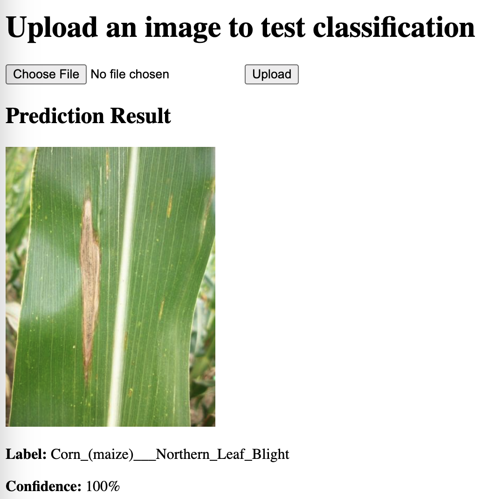

#### Running the App



1. Start the application:
   ```bash
   python app.py
   ```
2. Follow the on-screen instructions to interact with the app.
3. Ensure the trained model is loaded correctly by configuring the app settings if required.
4. **Introduction**: This app is designed to assist users in classifying images into `healthy` or `diseased` categories using a trained machine learning model. It simplifies the process of image classification and provides insights into the model's performance.
6. **/upload Endpoint**: The `/upload` endpoint allows users to programmatically upload images for classification. It accepts POST requests with image files and returns the classification results in JSON format. This is useful for integrating the app into other systems or automating workflows.


#### Training the Model
1. Ensure the dataset is organized as described below.
2. Run the training script:
   ```bash
   python train.py --data_dir dataset/ --output_dir model_output
   ```
   - `--data_dir`: Path to the dataset
   - `--output_dir`: Directory to save the trained model.

Organize your dataset as follows:

dataset/
    train/
        healthy/
            healthy1.jpg  # Image of a healthy sample
            healthy2.jpg  # Image of another healthy sample
            ...
        diseased/
            diseased1.jpg  # Image of a diseased sample
            diseased2.jpg  # Image of another diseased sample
            ...
    val/
        healthy/
            healthy_val1.jpg  # Validation image of a healthy sample
            ...
        diseased/
            diseased_val1.jpg  # Validation image of a diseased sample
            ...


